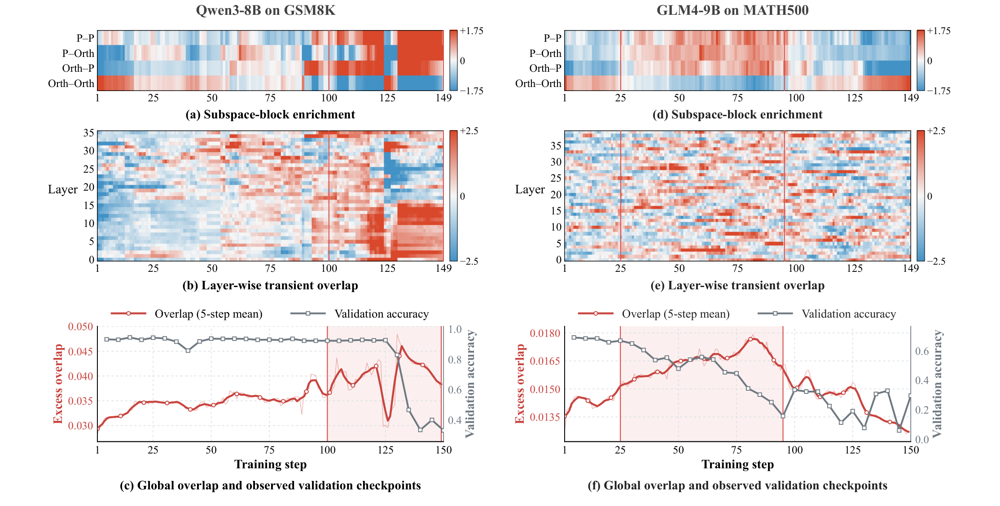

# GCPO

[](https://arxiv.org/abs/2608.11674)
[](https://www.python.org/)
[](LICENSE)

[GCPO: Diagnosing and Constraining Subspace Geometry in Rollout RL for LLMs](https://arxiv.org/abs/2608.11674) introduces Geometrically Constrained Policy Optimization, a post-training method that keeps policy updates away from principal subspaces of a frozen base model. This repository provides the open-source GCPO implementation on top of [verl](https://github.com/volcengine/verl), together with basis preparation, data preprocessing, and launch scripts for GRPO- and SDPO-style training.



*Figure: Six diagnostic panels summarize stepwise update overlap and validation performance for Qwen3-8B on GSM8K and GLM4-9B on MATH500, showing that higher overlap coincides with worse observed validation checkpoints in these runs.*

## 1. Overview

GCPO adds a geometry-aware constraint to rollout RL by projecting updates away from dominant singular directions of the frozen base model. The repository includes:

- basis construction for the protected subspace;
- dataset loading, splitting, and parquet preprocessing utilities;
- launchers for GRPO and SDPO configurations on local GPUs or Slurm; and
- the GCPO integration inside the verl training stack.

For environment details and dependency guidance, see [INSTALL.md](INSTALL.md).

## 2. Installation

GCPO targets Linux with NVIDIA GPUs for practical LLM training. Python 3.10-3.13 is supported, and Python 3.12 is the recommended default.

```bash
git clone https://github.com/deepnovacore/GCPO.git
cd GCPO

conda create -n gcpo python=3.12 -y
conda activate gcpo

# Install a PyTorch build that matches your CUDA toolkit/driver.
pip install torch

# Install GCPO with the rollout and math dependencies used below.
pip install -e ".[vllm,math]"
```

The training path uses vLLM by default, so PyTorch, CUDA, and vLLM must be mutually compatible. Pick the PyTorch wheel for your CUDA stack first, then install GCPO. Additional environment notes, optional FlashAttention, and verification commands are in [INSTALL.md](INSTALL.md).

## 3. Data Preparation

GCPO expects each task directory to contain `train.json` and `test.json`, followed by `train.parquet` and `test.parquet` generated by preprocessing.

### 3.1 Verified MATH500 example

The following sequence was verified locally for `math-ai/math500` with a deterministic 90/10 split (`450` train, `50` test):

```bash
python data/load_dataset.py \
  --dataset_name math-ai/math500 \
  --output_path datasets/math500/math500.json

python data/split_tasks.py \
  --json_path datasets/math500/math500.json \
  --output_dir datasets/math500 \
  --test_ratio 0.1 \
  --seed 42

python data/preprocess.py --data_source datasets/math500
```

The preprocessing step writes `datasets/math500/train.parquet` and `datasets/math500/test.parquet`, which are the files consumed by the training launcher.

### 3.2 Custom dataset schema

`data/preprocess.py` consumes the following JSON fields for each example:

- required: `prompt`, `answer`, `idx`, `tests`, `description`, `kind`, `dataset`, `elo`;
- optional: `system`; and
- training-only optional: `achievement_prior`.

The `tests` field is still required for non-code tasks and may contain a placeholder such as `"-"` when no executable test payload is used by the reward style.

## 4. Run GCPO

### 4.1 Prepare the principal-subspace basis

The model choice and `TARGET_MODULES` must match the later training run.

```bash
MODEL_PATH=Qwen/Qwen3-8B \
GCPO_TOPK=16 \
TARGET_MODULES=all-linear \
bash experiments/gcpo/prepare_basis.sh
```

By default, the basis is written to `artifacts/gcpo_basis/<model>/k16/basis.pt`. Run this step on a GPU allocation; set `DEVICE=cpu` only for small models.

### 4.2 Train with GRPO + GCPO

```bash
MODEL_PATH=Qwen/Qwen3-8B \
TASK=datasets/math500 \
CONFIG_NAME=baseline_grpo \
N_GPUS_PER_NODE=4 \
bash experiments/gcpo/train_gcpo.sh
```

### 4.3 Train with SDPO + GCPO

```bash
MODEL_PATH=Qwen/Qwen3-8B \
TASK=datasets/math500 \
CONFIG_NAME=sdpo \
SDPO_ALPHA=0.5 \
N_GPUS_PER_NODE=4 \
bash experiments/gcpo/train_gcpo.sh
```

### 4.4 Launch on Slurm

Adapt the resource directives in `experiments/gcpo/submit_gcpo.sbatch`, export the same environment variables you would use locally, and then submit:

```bash
sbatch experiments/gcpo/submit_gcpo.sbatch
```

### 4.5 Main overrides

| Variable | Default | Meaning |
| --- | --- | --- |
| `GCPO_TOPK` | `16` | Number of protected singular directions |
| `LORA_RANK` | `32` | Trainable LoRA rank |
| `LORA_ALPHA` | `16` | LoRA scaling parameter |
| `TRAIN_BATCH_SIZE` | `32` | Prompt batch size |
| `ROLLOUT_N` | `8` | Samples generated per prompt |
| `LR` | `1e-5` | Actor learning rate |
| `TOTAL_TRAINING_STEPS` | `300` | Number of policy updates |
| `OUTPUT_DIR` | repository checkpoint directory | Checkpoint destination |

### 4.6 Logging and dry runs

Weights & Biases is optional. The launcher logs only to the console unless `WANDB_API_KEY` is already present in the environment.

Set `DRY_RUN=1` to print the fully resolved launch command without checking for data/model artifacts or starting Ray:

```bash
DRY_RUN=1 bash experiments/gcpo/train_gcpo.sh
```

## 5. Docker Quick Start

The root `Dockerfile` builds a CUDA 12.4.1 / Python 3.12 image and installs GCPO with the default `vllm` and `math` extras:

```bash
docker build -t gcpo:latest .
```

Before running the container, install the NVIDIA Container Toolkit on the host and make sure the host driver, CUDA runtime, PyTorch build, and vLLM version are compatible with your GPUs. The commands below are intended as a practical starting point; they are not a claim of full local Docker build or 8B training validation across all environments.

```bash
docker run --rm -it \
  --gpus all \
  --network host \
  --ipc=host \
  --shm-size=16g \
  -v /path/to/GCPO:/app \
  -v /path/to/huggingface-cache:/root/.cache/huggingface \
  -v /path/to/datasets:/app/datasets \
  -v /path/to/artifacts:/app/artifacts \
  -v /path/to/checkpoints:/app/checkpoints \
  -w /app \
  gcpo:latest
```

In this example, `/path/to/...` paths are host paths. Inside the container, the source checkout is mounted at `/app`, matching the image's built-in working tree and editable install location. The Hugging Face cache is available at `/root/.cache/huggingface`, datasets at `/app/datasets`, basis artifacts at `/app/artifacts`, and checkpoints at `/app/checkpoints`.

## 6. Implementation

- `verl/utils/gcpo.py`: constrained LoRA parameterization and rollout export.
- `scripts/prepare_gcpo_basis.py`: frozen-model SVD basis preparation.
- `verl/workers/fsdp_workers.py`: actor and rollout integration.
- `experiments/gcpo/`: portable preparation, training, and Slurm launchers.

## 7. Citation

If you find GCPO useful in your research, please cite our paper:

```bibtex
@article{yang2026gcpo,
  title={GCPO: Diagnosing and Constraining Subspace Geometry in Rollout RL for LLMs},
  author={Kai Yang and Jingwei Xu and Wanyu Wang and Kai-Yuan Guo and Zhenbo Yu and Yi Wang and Yu Qiao},
  journal={arXiv preprint arXiv:2608.11674},
  year={2026}
}
```

## 8. Acknowledgements

This codebase builds on verl and the SDPO implementation. Their original licenses and notices are preserved in the repository.
